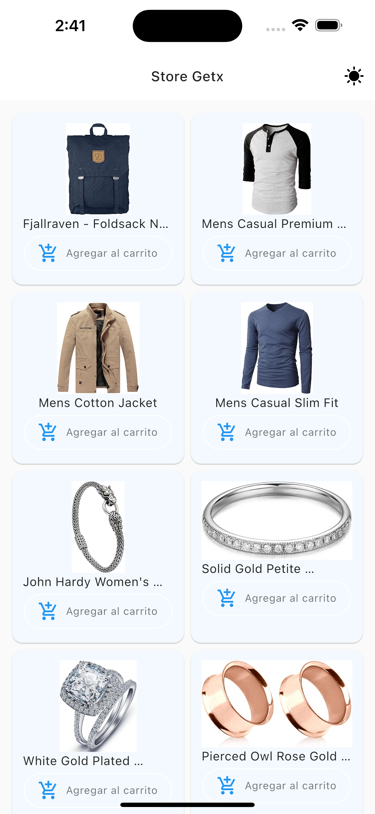

# [fakestoreapi.com](https://fakestoreapi.com/products)

## Api consumed using getx

 <table>
    <thead>
      <tr>
        <th><Strong>Home</Strong></th>
      </tr>
    </thead>
    <tbody>
        <tr>
           <td> </td>
        </tr>
    </tbody>
  </table>